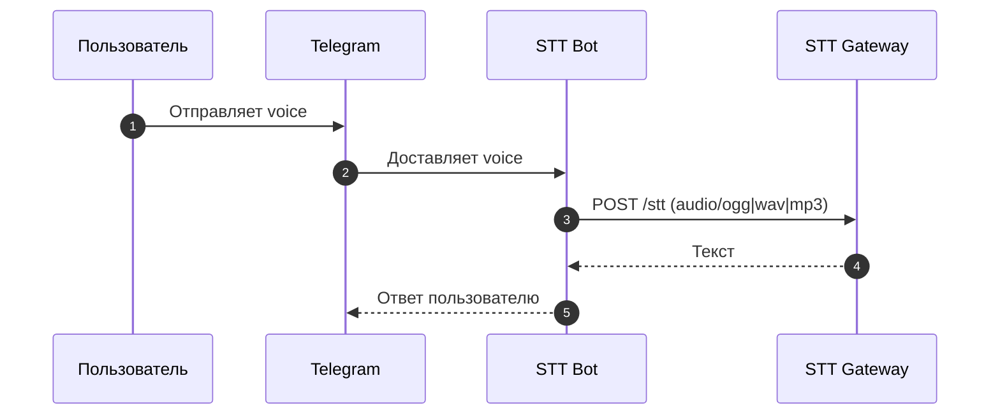

# 🎙️ STT Bot — Telegram аудио → текст

Полноценный Telegram‑бот для расшифровки аудио. Принимает voice‑сообщения и аудиофайлы, отправляет их в STT Gateway и возвращает текст пользователю в ответе.  
Добавьте бота в группу, выдайте нужные права — и он будет переводить **все аудиосообщения** от любых участников. ✅

---

## ✨ Возможности
- 🗣️ Расшифровка голосовых сообщений в личных чатах
- 🎵 Поддержка аудиофайлов: `ogg/opus`, `wav`, `mp3`
- 👥 Работа в группах: транскрибация **всех** voice‑сообщений
- 🔁 Потоковый и обычный режимы обработки
- ⏱️ Настраиваемые таймауты и параметры STT
- 📬 Фоновая обработка: бот сразу подтверждает приём и присылает результат позже
- ✂️ Умное разбиение длинных текстов на сообщения с нумерацией
- 🧹 Авто‑очистка временных файлов

---

## 🧠 Как это работает



---

## 🗺️ Архитектура (схема)

```
┌────────────┐   voice    ┌───────────┐   audio/ogg   ┌─────────────┐
│ Telegram   │──────────▶ │  STT Bot  │──────────────▶│ STT Gateway │
└────────────┘  updates   └───────────┘    response   └─────────────┘
                        ▲                     │
                        └──── text reply ─────┘
```

---

## ✅ Требования
- Python 3.11
- Созданный бот в Telegram (через @BotFather)
- Запущенный STT Gateway

---

## 🚀 Быстрый старт (Windows 10/11)
1. Создайте виртуальное окружение:
```powershell
py -3.11 -m venv .venv
```
2. Активируйте окружение:
```powershell
Set-ExecutionPolicy -Scope Process -ExecutionPolicy Bypass
.\.venv\Scripts\Activate.ps1
```
3. Установите зависимости:
```powershell
python -m pip install --upgrade pip
pip install -r requirements.txt
```
4. Создайте `.env` (см. `.env.example`)
5. Запуск:
```powershell
python bot.py
```

---

## 🐧 Деплой на Ubuntu/Linux (systemd)

Ниже — безопасный и удобный способ запуска бота как сервиса с автозапуском и автоперезапуском.

### 1) Подготовка сервера
```bash
sudo apt update
sudo apt install -y python3.11 python3.11-venv
sudo adduser --system --group --home /opt/stt-bot sttbot
```

### 2) Развертывание кода
Скопируйте проект в `/opt/stt-bot` (например, через `git clone` или `scp`) и выставьте владельца:
```bash
sudo mkdir -p /opt/stt-bot
sudo chown -R sttbot:sttbot /opt/stt-bot
```

### 3) Установка зависимостей
```bash
sudo -u sttbot python3.11 -m venv /opt/stt-bot/.venv
sudo -u sttbot /opt/stt-bot/.venv/bin/python -m pip install --upgrade pip
sudo -u sttbot /opt/stt-bot/.venv/bin/pip install -r /opt/stt-bot/requirements.txt
```

### 4) Настройка окружения
Создайте файл `/opt/stt-bot/.env` по примеру `.env.example`:
```bash
sudo -u sttbot nano /opt/stt-bot/.env
```

### 5) systemd unit
Создайте файл `/etc/systemd/system/stt-bot.service`:
```ini
[Unit]
Description=STT Telegram Bot
After=network.target

[Service]
User=sttbot
Group=sttbot
WorkingDirectory=/opt/stt-bot
EnvironmentFile=/opt/stt-bot/.env
ExecStart=/opt/stt-bot/.venv/bin/python /opt/stt-bot/bot.py
Restart=always
RestartSec=3
TimeoutStopSec=30

[Install]
WantedBy=multi-user.target
```

### 6) Запуск и автозапуск
```bash
sudo systemctl daemon-reload
sudo systemctl enable --now stt-bot
```

### 7) Проверка статуса и логов
```bash
sudo systemctl status stt-bot
sudo journalctl -u stt-bot -f
```

---

## 🚀 Deploy на alwaysdata (Full Guide)
> Alwaysdata — это **PaaS‑хостинг, не VPS**. Здесь нельзя использовать `sudo`, `apt install`, systemd‑службы и системные пакеты.  
> Зато можно использовать `virtualenv`, а сервисы создаются через панель управления и автоматически стартуют после перезапуска.

### 📌 Важно понимать
- ❌ нет `sudo`
- ❌ нельзя `apt install`
- ❌ нельзя создавать `systemd`‑службы
- ❌ нельзя ставить системные пакеты
- ✅ можно использовать `virtualenv`
- ✅ можно создавать сервисы через панель управления
- ✅ сервисы автоматически запускаются после перезагрузки

### 1) Подключение к серверу
После создания аккаунта:
- Зайти в панель управления
- Создать SSH‑пользователя
- Подключиться:
```bash
ssh username@sshX.alwaysdata.com
```

### 2) Загрузка проекта на сервер
Вариант A — через Git (рекомендуется):
```bash
cd
git clone https://github.com/yourname/yourrepo.git
cd yourrepo
```
Вариант B — через SFTP:
- Загрузить папку проекта в: `/home/username/`

### 3) Проверка версии Python
```bash
python3 --version
```
Не использовать Python 3.13. Рекомендуется Python 3.11.
Проверить доступные версии:
```bash
ls /usr/bin/python*
```

### 4) Создание виртуального окружения
Удаляем старое (если есть):
```bash
rm -rf venv
```
Создаём новое:
```bash
python3.11 -m venv venv
```
Активируем:
```bash
source venv/bin/activate
```

### 5) Установка зависимостей
Обновляем pip:
```bash
pip install --upgrade pip
```
Устанавливаем зависимости:
```bash
pip install -r requirements.txt
```
Если используется `.env`:
```bash
pip install python-dotenv
```

### 6) Проверка ручного запуска
```bash
python bot.py
```
Если бот запускается — всё настроено правильно.  
Остановить: `CTRL+C`

### 7) Работа с `.env`
Файл `.env` должен лежать в корне проекта:
`/home/username/yourrepo/.env`

Пример:
```env
TELEGRAM_BOT_TOKEN=123456:ABCDEF
STT_URL=http://localhost:8000/stt
STT_API_KEY=your_key
```

В коде уже используется:
```python
from dotenv import load_dotenv
import os

load_dotenv()
TELEGRAM_BOT_TOKEN = os.getenv("TELEGRAM_BOT_TOKEN")
```

Обязательно указать правильный `Working directory` в сервисе (см. ниже).

### 8) Создание автозапуска (Service)
Путь в панели: `Advanced → Services → Add service`

Заполнить поля:
- 🔹 `SSH user`: ваш SSH‑пользователь (например `username`)
- 🔹 `Command`: **не использовать `source`**
```bash
/home/username/yourrepo/venv/bin/python /home/username/yourrepo/bot.py
```
- 🔹 `Working directory`:
```text
/home/username/yourrepo
```
- 🔹 `Monitoring command`: можно оставить пустым
- 🔹 `Environment`:
Если используется `.env` — оставить пустым.  
Если без `.env`, можно задать:
```text
TELEGRAM_BOT_TOKEN=your_token_here
```
- 🔹 `Paused`: **не отмечать**
- 🔹 `Annotation`: любое описание, например `Telegram bot service`

### 9) После сохранения
- Нажать `Save`
- Убедиться, что статус `Running`
- Проверить логи сервиса

### 🔁 Автоперезапуск
Сервис типа `Command` на alwaysdata:
- автоматически стартует после перезагрузки сервера
- автоматически перезапускается при падении процесса

Дополнительных настроек не требуется. ✅

---

## 📌 Поддерживаемые типы сообщений
- Voice‑сообщения Telegram
- Аудиофайлы, отправленные как `audio` или `document`
- Форматы: `ogg/opus`, `wav`, `mp3`

---

## 🔁 Очерёдность и обработка
- Бот обрабатывает сообщения **по одному** (очередь апдейтов).
- Новые сообщения не теряются и не вызывают ошибок — они ждут своей очереди.

---

## ✂️ Длинные ответы и лимиты Telegram
Telegram ограничивает длину одного сообщения. Бот заранее делит длинный текст:
- по предложениям;
- при необходимости — по словам;
- без потери символов.

Если текст короткий, он отправляется одним сообщением.  
Если длинный — сообщения нумеруются: `1/6`, `2/6`, ...  
Лимит на сообщение настраивается через `TG_MESSAGE_MAX_LEN` (по умолчанию `3700`).

---

## ⚙️ Переменные окружения
- `TELEGRAM_BOT_TOKEN` — токен Telegram‑бота
- `STT_URL` — URL STT Gateway, например `http://localhost:8000/stt`
- `STT_API_KEY` — API‑ключ STT Gateway
- `STT_STREAM` — `true` или `false` (по умолчанию `false`)
- `STT_TIMEOUT_SECONDS` — таймаут запроса к STT (по умолчанию `180`)
- `STT_READ_TIMEOUT_SECONDS` — таймаут чтения ответа; `0` = без лимита (по умолчанию `0`)
- `BOT_TMP_DIR` — путь для временных файлов (по умолчанию `./tmp`)
- `BOT_LOG_LEVEL` — уровень логирования (по умолчанию `INFO`)
- `BOT_QUIET_LOGGERS` — список логгеров для подавления шума (по умолчанию `telegram,telegram.ext,httpx,apscheduler`)
- `TG_MESSAGE_MAX_LEN` — максимальная длина ответа в одном сообщении (по умолчанию `3700`)

---

## 👥 Работа в группах
Чтобы бот обрабатывал аудио в группе:
1. Добавьте бота в группу, сделайте админом
2. Выдайте права на чтение сообщений и голосовых
3. Убедитесь, что бот **не ограничен** и видит все сообщения

После этого бот будет автоматически расшифровывать **каждое** voice‑сообщение в группе. 💬

---

## 🧪 Режимы работы
- Обычный режим: один запрос → один ответ
- Потоковый режим: читает SSE и собирает полный текст

Переключение через `STT_STREAM=true|false`.

---

## 📨 Как выглядит ответ
- Сразу: `Принял, обрабатываю. Отправлю результат позже.`
- Затем: готовая расшифровка (одно или несколько сообщений)

---

## 🧰 Troubleshooting
- Бот не отвечает: проверьте `TELEGRAM_BOT_TOKEN`
- STT ошибки: проверьте `STT_URL` и `STT_API_KEY`
- Долгая обработка: увеличьте `STT_TIMEOUT_SECONDS`
- Шум в логах: настройте `BOT_LOG_LEVEL` и `BOT_QUIET_LOGGERS`

---

## 🔐 Безопасность
- Храните `.env` вне публичного доступа
- Не публикуйте `TELEGRAM_BOT_TOKEN` и `STT_API_KEY`

---

## 📦 Что внутри
- `bot.py` — основной код бота
- `requirements.txt` — зависимости
- `.env.example` — шаблон окружения

---

## 📄 Лицензия
Добавьте файл лицензии, если требуется для вашего проекта.
